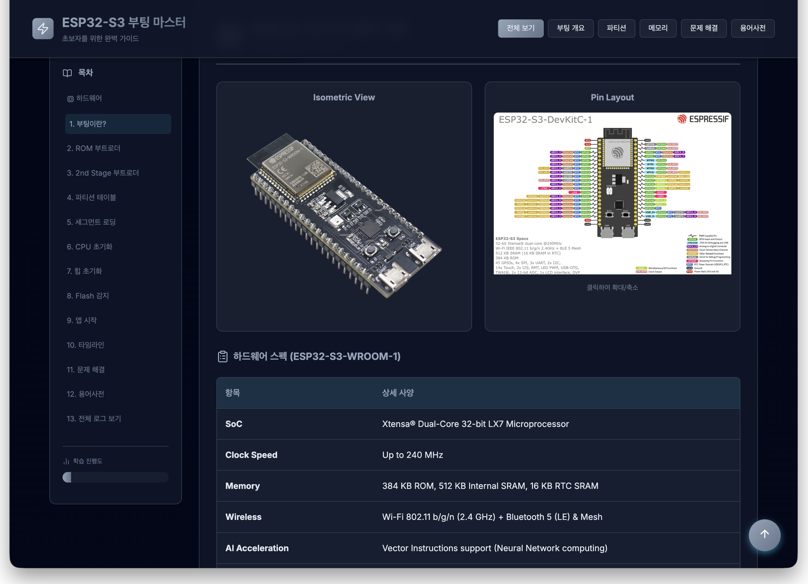
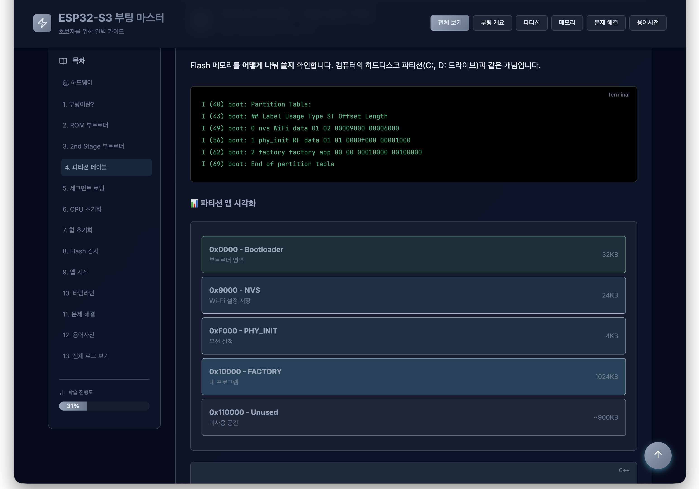
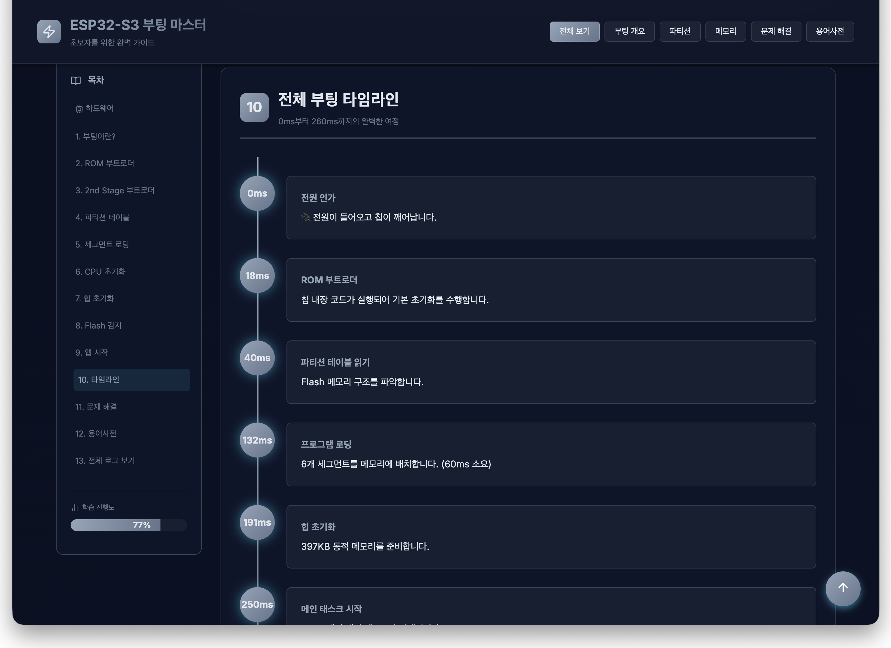
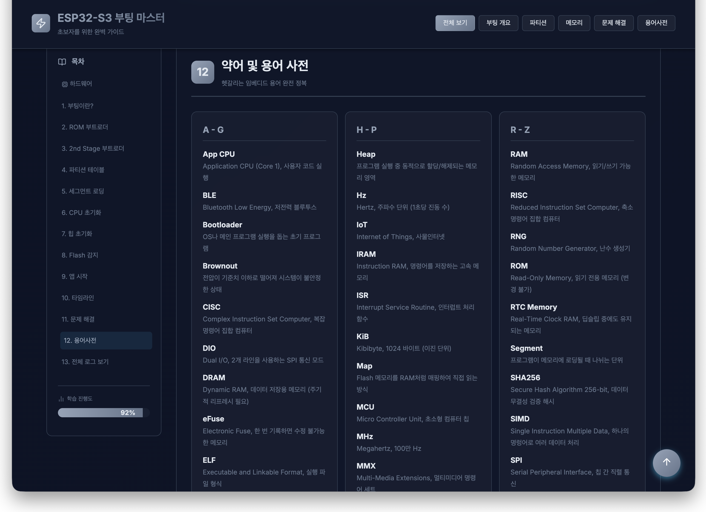

# ⚡ ESP32-S3 부팅 과정 완벽 가이드 (Boot Process Guide)

ESP32-S3의 하드웨어 초기화부터 애플리케이션 실행까지의 복잡한 부팅 과정을 초보자도 쉽게 이해할 수 있도록 정리한 인터랙티브 학습 웹페이지입니다.

## 🚀 제작 배경
ESP32 시리즈는 강력한 성능을 자랑하지만, 전원이 켜진 후 실제 사용자의 코드가 실행되기까지 내부적으로 어떤 일이 일어나는지 이해하는 것은 입문자에게 매우 어렵습니다. 복잡한 공식 문서를 뒤지는 대신, **단계별 시각화 자료와 시뮬레이션된 로그**를 통해 부팅 메커니즘을 직관적으로 학습할 수 있는 환경을 만들고자 제작하게 되었습니다.

## 🎯 제작 의도
*   **복잡한 개념의 시각화**: 타임라인과 메모리 맵을 통해 부팅 단계를 한눈에 파악할 수 있게 합니다.
*   **실전 로그 분석**: 실제 터미널에서 출력되는 부팅 로그를 기반으로 각 메시지의 의미를 설명합니다.
*   **학습 경험 최적화**: 퀴즈와 진행도 표시 기능을 통해 사용자가 지루하지 않게 학습 목표를 달성하도록 돕습니다.
*   **반응형 디자인**: PC와 모바일 어디서든 최적화된 학습 환경을 제공합니다.

## ✨ 주요 기능
1.  **단계별 부팅 가이드**: ROM 부트로더부터 앱 시작까지 12개 이상의 챕터로 상세 구성.
2.  **인터랙티브 타임라인**: 부팅 순서에 따른 하드웨어/소프트웨어 변화를 시각적으로 추적.
3.  **코드 & 로그 박스**: 실제 ESP-IDF 기반 코드 조각과 터미널 로그 분석 제공.
4.  **학습 퀴즈**: 각 단계를 제대로 이해했는지 확인할 수 있는 퀴즈 시스템.
5.  **하드웨어 정보**: ESP32-S3 DevKitC-1 보드의 핀 레이아웃 및 상세 스펙 제공.

## 📸 프로젝트 스크린샷

### 1. 메인 가이드 및 하드웨어 개요

*프로젝트의 전반적인 레이아웃과 하드웨어 스펙 정보를 확인할 수 있습니다.*

### 2. 가독성 높은 챕터 구성

*부팅 단계를 논리적으로 구분하여 상세한 설명과 함께 제공합니다.*

### 3. 터미널 로그 및 시각화 자료

*실제 부팅 로그 시뮬레이션과 인터랙티브 요소를 통해 이해도를 높입니다.*

### 4. 퀴즈를 통한 학습 확인

*각 단계를 마칠 때마다 퀴즈를 통해 학습 내용을 복습합니다.*

## 🛠 기술 스택
*   **Frontend**: HTML5, Vanilla CSS (Modern CSS Variables)
*   **Icons**: [Lucide Icons](https://lucide.dev/)
*   **Fonts**: Google Fonts (Inter, JetBrains Mono)
*   **Animation**: CSS Keyframes for smooth transitions

## 📄 사용 방법
`index.html` 파일을 웹 브라우저로 열면 즉시 학습을 시작할 수 있습니다. 별도의 서버 설정이나 라이브러리 설치가 필요 없는 스탠드얼론 형태의 페이지입니다.

---
*본 가이드는 ESP32-S3 기술 문서와 실제 로그 분석을 바탕으로 제작되었습니다.*
